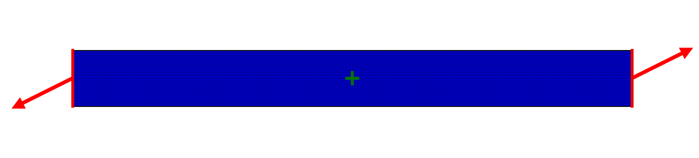
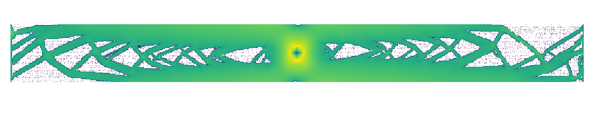

# FEM Solver for solving 2D plane strain problems with square elements
Features: Displacement boundary conditions, Easy to use geometry module for constructing stiffness matrix, Efficient solver based on CHOLMOD, Automatic Geometry Optimization

Dependecies: numpy, scipy and sksparse

For an example of how to use the solver see femsolver.py test()
For an example of how to use the optimization try running opy.py

## Example
Consider the following problem where a bar of metal is constrained in place by a a cross in the middle. Then on both ends of the bar you apply a force in opposite directions as shown in the picture below.

If we run the solver we get the following Von-Mises stresses:

Running opy.py then yields the "optimized" geometry below where a lot of metal has been removed while maintaining high strength.

