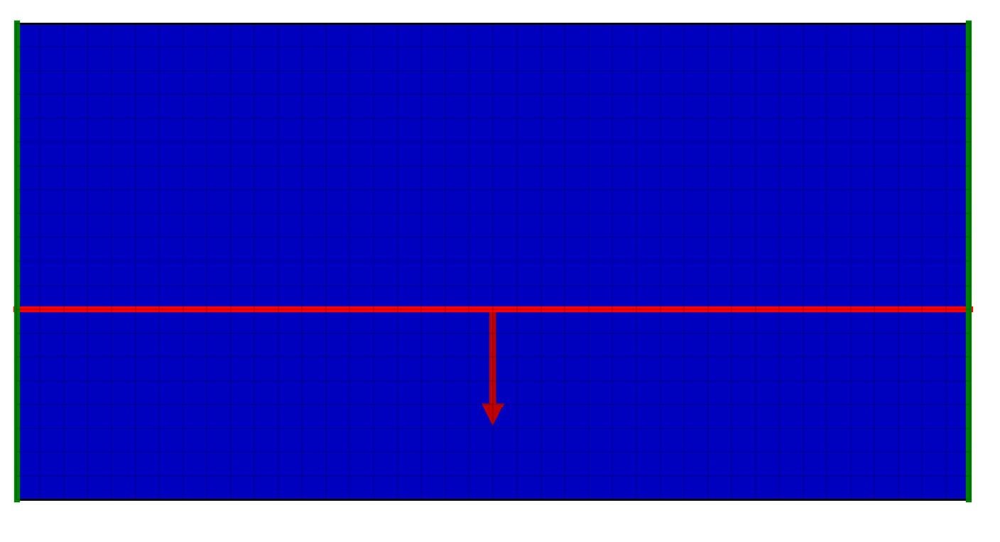
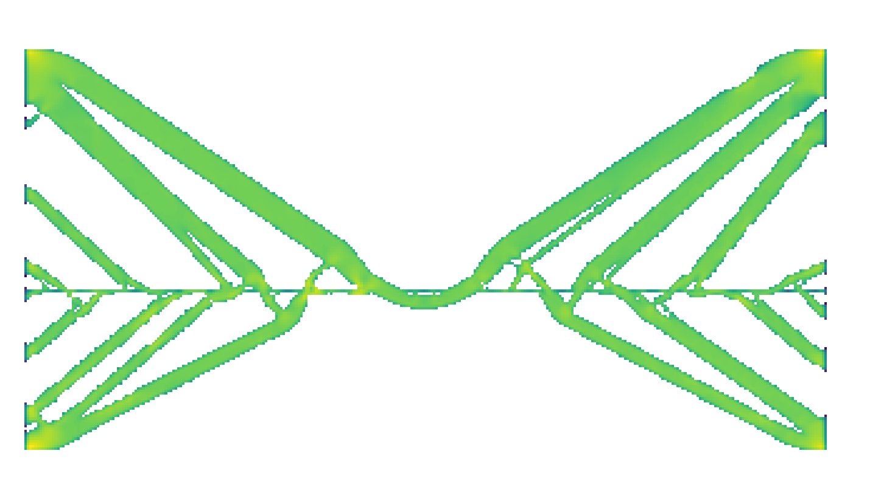

# FEM Solver for solving 2D plane strain problems with square elements
Features: Zero displacement boundary conditions, Easy to use geometry module for constructing stiffness matrix, Efficient solver based on CHOLMOD, Automatic Geometry Optimization

Dependencies: numpy, scipy and sksparse

For an example of how to use the solver see femsolver.py test()
For an example of how to use the optimization try running opy.py

I make no claims about the following solutions being 'optimal', but they do make for interesting structures.

## Example 1 (bar)
Consider the following problem where a bar of metal is constrained in place by a a cross in the middle. Then on both ends of the bar you apply a force in opposite directions as shown in the picture below.

If we run the solver we get the following Von-Mises stresses:

Running opy.py then yields the "optimized" geometry below where a lot of metal has been removed while maintaining high strength.

## Example 2 (Bridge)
Now instead, consider a bridge which is fixed on both sides with an even loading along a straight road in the middle:

The optimizer then gives this cool looking bridge:

